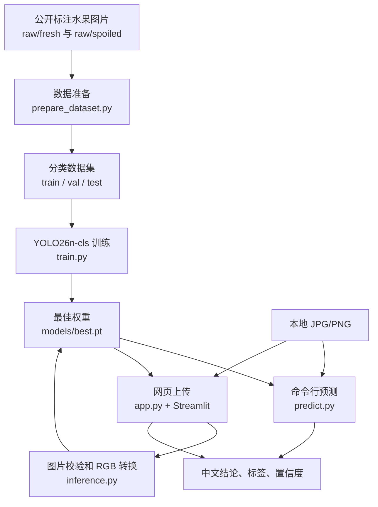
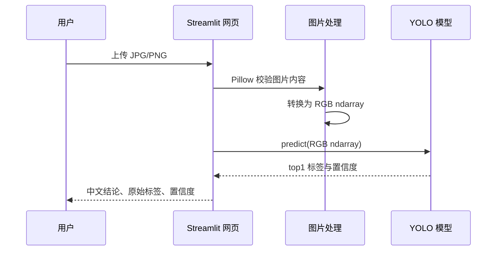

# 基于 YOLO 的水果新鲜度图片判别系统：技术文档

## 1. 项目定位

本项目是一个本地运行的农产品外观判别原型。用户上传一张水果图片，系统用 Ultralytics YOLO 分类模型输出两类结果：`fresh`（新鲜）或 `spoiled`（变质/腐烂）。

当前版本采用整图二分类：不接摄像头、不处理视频流、不输出目标框，也不判断糖度、硬度、内部腐烂或食品安全。网页端用于本机演示和上传测试，训练与推理均在本地完成。

## 2. 系统架构



| 层级 | 文件 | 职责 |
|---|---|---|
| 数据层 | `src/fruit_grader/dataset.py` | 验证图片、校验类别、以固定随机种子按类切分。 |
| 数据入口 | `scripts/prepare_dataset.py` | 将原始图片转换为 YOLO 分类目录。 |
| 训练层 | `train.py` | 校验数据目录、训练、保存最佳模型、测试集验证。 |
| 推理层 | `src/fruit_grader/inference.py` | 统一预测结果，验证上传图片，转换为 RGB 像素数组。 |
| 命令行 | `predict.py` | 对单张本地图片进行预测。 |
| 网页层 | `app.py` | Streamlit 上传、预览和结果展示。 |
| 测试层 | `tests/` | 覆盖切分、输入校验、结果映射、RGB 转换和参数解析。 |

## 3. 数据与标签

| 标签 | 页面显示 | 定义 |
|---|---|---|
| `fresh` | 新鲜 | 外观无明显腐烂特征。 |
| `spoiled` | 变质 | 外观有腐烂、霉变或明显不新鲜特征。 |

原始数据目录：

```text
data/raw/{fresh,spoiled}/
```

处理后的目录：

```text
data/processed/
  train/{fresh,spoiled}/
  val/{fresh,spoiled}/
  test/{fresh,spoiled}/
```

数据准备只接受可读的 JPG、JPEG、PNG、BMP、WEBP 图片，默认按照 70% / 15% / 15% 切分，并使用随机种子 `42` 保持可复现。训练数据来源为 Mendeley Data 数据集《Fresh and Rotten Fruits Dataset for Machine-Based Evaluation of Fruit Quality》，作者为 Nusrat Sultana、Musfika Jahan、Mohammad Shorif Uddin，记录页为 <https://data.mendeley.com/datasets/bdd69gyhv8/1>，DOI 为 `10.17632/bdd69gyhv8.1`，许可为 <https://creativecommons.org/licenses/by/4.0/>；本项目在此基础上筛选图片并训练 `fresh/spoiled` 二分类模型，使用或再分发衍生成果时应保留原始署名、许可、DOI 和修改说明。

## 4. 数据规模与训练记录

第四轮使用的最终数据集：

| 类别 | 原始图片 | 训练集 | 验证集 | 测试集 |
|---|---:|---:|---:|---:|
| fresh | 218 | 152 | 32 | 34 |
| spoiled | 214 | 149 | 32 | 33 |
| 合计 | 432 | 301 | 64 | 67 |

四轮训练累计涉及 987 张次图片；由于每一轮均在前一轮数据基础上扩充，这不是 987 张独立图片。最终去重后的原始数据规模为 432 张。

| 轮次 | 数据规模（fresh / spoiled） | 配置 | 测试 Top-1 准确率 |
|---|---:|---|---:|
| 第一轮 | 61 / 59 | CPU，15 轮 | 90.0%（20 张） |
| 第二轮 | 81 / 79 | CPU，25 轮 | 96.15%（26 张） |
| 第三轮 | 139 / 136 | CPU，20 轮 | 95.3%（43 张） |
| 第四轮 | 218 / 214 | RTX 4060，20 轮，batch=16 | 100.0%（67 张） |

第四轮验证集最佳 Top-1 准确率为 98.4%，最终测试集输出为 100.0%。测试集只有 67 张，且公开图片可能在背景、拍摄风格或来源上相近，因此该结果只能说明当前切分上的表现，不能直接代表真实农产品分级场景的泛化精度。

## 5. 模型与环境

- 模型：`yolo26n-cls` 轻量分类模型；
- 输入尺寸：224 × 224；
- 框架：Ultralytics 8.4.121；
- Python：3.12.10；
- GPU 环境：PyTorch 2.5.1 + CUDA 12.4；
- 加速设备：NVIDIA GeForce RTX 4060 Laptop GPU（8 GB 显存）。

训练可通过 `--device 0` 明确使用第一张显卡：

```powershell
python scripts/prepare_dataset.py --raw-dir data/raw --output-dir data/processed --seed 42 --split 70,15,15
python train.py --data data/processed --model models/best.pt --epochs 20 --imgsz 224 --batch 16 --device 0 --project runs --name fruit_freshness_v4 --output-model models/best.pt
```

训练脚本会校验训练、验证目录均含有两个标签，训练后复制最佳权重到 `models/best.pt`，并自动在测试集上评估。

## 6. 推理流程与操作



网页只在上传后加载模型，使用 `@st.cache_resource` 缓存模型。上传内容先经过 Pillow 校验，再转换为 YOLO 支持的 RGB 像素数组，避免将原始图片字节直接传给模型。

```powershell
# 单图预测
python predict.py --image <图片路径> --model models/best.pt

# 启动本机网页
streamlit run app.py --server.address 127.0.0.1 --server.port 8501 --server.headless true

# 自动化检查
pytest -q
```

网页默认仅监听 `127.0.0.1`。预测结果仅表示图片中可见的外观状态，并不构成食品安全或内部品质结论。

## 7. 安全边界与发布前检查

### 当前已落实的保护

- `.gitignore` 已排除 `data/raw/`、`data/processed/`、`models/*.pt`、`runs/`，并额外忽略根目录 `yolo26n.pt` 与下载临时文件 `models/best.pt.part`；
- 网页上传仅接受 `jpg/jpeg/png`，原始字节大小上限为 10 MiB，像素总数上限为 20,000,000；
- 上传内容会先经过 Pillow 完整性校验，再统一转换为 YOLO 支持的 RGB `ndarray`，避免把未知原始字节直接传给模型；
- 网页模型路径被限制为项目 `models/` 目录内的 `.pt` 文件，拒绝路径穿越、目录外模型和其他后缀；
- `scripts/download_model.py` 只接受 HTTPS Release 地址，先下载到 `best.pt.part`，完成 SHA-256 校验后再原子替换正式模型；
- 默认网页仅监听 `127.0.0.1:8501`，不主动对局域网或公网开放；
- 当前源码检查未发现 API Key、Token、密码、私钥或用户凭据。

### 开源发布状态

- 代码仓库按 AGPL-3.0 发布，根目录 `LICENSE` 已提供完整 GNU Affero General Public License v3.0 文本；
- 模型下载清单 `model-manifest.json` 固定到 `v1.0.0` Release，当前 `best.pt` 的 SHA-256 为 `f4c996c44b95f27717874d81c4bd7c7a04dbf09ac5d7cb8bacdd1fdc30eecfe6`；
- 训练数据来源声明为 Mendeley Data 记录 `bdd69gyhv8/1`，许可为 CC BY 4.0，引用 DOI 为 `10.17632/bdd69gyhv8.1`；
- 仓库不直接分发原始图片数据，只分发代码、文档、下载清单和开源运行脚本。

## 8. 局限与扩展

1. 当前只能判断图片外观的“新鲜/变质”，不能替代食品安全检测。
2. 扩展到番茄、柑橘、土豆等农产品时，需要补充对应标签和真实场景图片，并重新训练、评估模型。
3. 当前为整图分类；多水果或复杂背景场景需要改用目标检测并补充边界框标注。
4. 后续应按“实物/批次”而非单张图片划分训练与测试，增强真实场景泛化验证。
5. 功能稳定后可将推理封装为服务，再开发小程序或桌面端；目前建议保持网页端本地演示。
